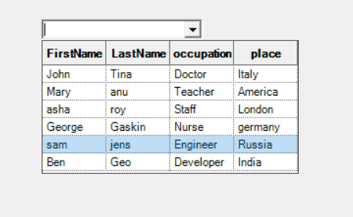

# How-to-display-multiple-members-in-WinForms-MultiColumnComboBox
The multicolumn combo box is an advanced combo box control that has the capability of showing multiple columns in the drop-down list.

## Core Feature
Built by combining the combo box base with Syncfusion Grid control, this multicolumn combo box provides a very rich combo drop-down option for your forms. Also, since the drop-down list is bound virtually to the data source, data binding to a very large data source is instantaneous.

## Custom Flitering
The multi-column combo box populates list values based on filtering criteria.

By custom filtering, items can be filtered by comparing all the columns or specific columns using predicate filter options.

